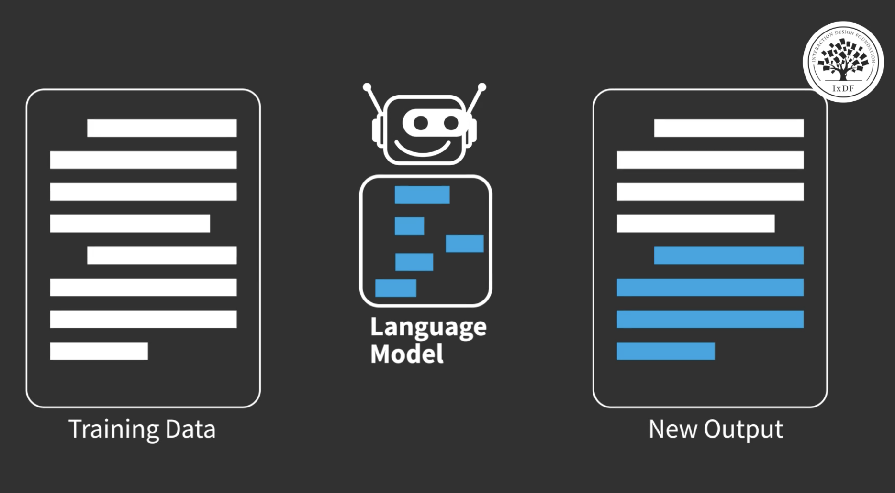

## AI Revolution and Adoption

### Rapid Technological Shift

Quoted verbatim:

> We're in the middle of AI revolution,
> comparable to the early days of the internet or the beginning of the mobile industry.

- AI adoption is growing rapidly across industries.
- New AI tools are emerging quickly and being widely adopted.
- People are exploring AI with a mix of:
  - Curiosity
  - Excitement
  - Fear
  - Reluctance

### Why AI Is Growing So Fast

- Recent AI tools have experienced **extremely high adoption rates**.
- Increased accessibility allows more people to experiment with AI tools.
- Designers and professionals are actively exploring new capabilities.

## What Is Generative AI

### Definition

- Generative AI: A class of artificial intelligence models that **create new content** such as text, images, music, or other media.
- Training data: Existing datasets used to teach the model patterns and structures.
- Generated content: New outputs that resemble the patterns learned from the training data.

Generative AI differs from traditional AI systems because it **creates new outputs rather than simply executing predefined instructions**.

### AI Hierarchy

- Artificial Intelligence (AI): The broad field of building intelligent systems.
- Machine Learning: A subset of AI that enables systems to learn from data.
- Deep Learning: A subset of machine learning using neural networks.
- Generative AI: A subset of deep learning focused on **creating new content**.

Hierarchy:

- AI
  - Machine Learning
    - Deep Learning
      - Generative AI

## How Generative AI Works

### Training Process

1. Training on data: The model learns patterns from large datasets.
2. Pattern learning: Machine learning techniques identify relationships in the data.
3. Generation: The system creates new outputs that resemble the learned patterns.

Generated outputs are **new but share characteristics with the training data**.

### Neural Networks

- Neural networks: AI systems inspired by the structure of the human brain.
- Nodes: Interconnected units that process and transmit information.
- Learning process: The network adjusts its internal parameters to recognize patterns in data.

## Types of Generative AI Models

### Language Models

- Language models: Systems trained on large text datasets to understand language patterns.

Capabilities:

- Text generation
- Translation
- Summarization
- Question answering
- Grammar correction
- Chatbots and conversational agents

Language models work by **predicting the next word or token based on previous context**.

### Image Models

<video width="1280" height="720" controls>
  <source src="/assets/videos/ai-for-designers/design-in-the-age-of-ai/ai-for-designers-01-04-td-snippet-generative-ai.mp4" type="video/mp4">
  Your browser does not support the video tag.
</video>

- Image models: Systems designed to generate images based on prompts.

Common technique:

- Diffusion models: Generate images by gradually removing noise from random data until a coherent image forms.

Capabilities:

- Image generation
- Image completion
- Image captioning
- Visual question answering
- Image search
- Super-resolution
- Video or animation generation

## Applications of Generative AI in Design

### Visual Design Applications

Generative AI can assist designers by generating:

- Visual mockups
- Icons
- Product illustrations
- Concept artwork
- Photography-style images

### Content Creation

Generative AI tools can produce written content such as:

- UX copy
- Product descriptions
- Emails
- Documentation

### Research Support

- Synthetic data: Artificially generated data used to supplement limited real datasets.
- Use case: Supporting research when real data is scarce.

Note:

- Real data is still preferred when available.

## Generative AI Tool Landscape

### Rapidly Changing Ecosystem

- New AI tools appear frequently.
- Some tools disappear quickly.
- The ecosystem evolves rapidly, making it difficult to track every tool.

However, several tools have become **stable and widely used**.

### Examples of Generative AI Tools

- ChatGPT: Text generation and conversational AI.
- Midjourney: Image generation from prompts.

## Key Takeaways

- Generative AI: A subset of deep learning focused on **creating new content**.
- It generates outputs such as **text, images, audio, or video**.
- Language models generate text-based content.
- Image models generate visual content using techniques like diffusion.
- Designers can use generative AI for:
  - Visual design
  - Content creation
  - Research support
- The generative AI ecosystem is evolving rapidly, with new tools emerging continuously.

## References

- Interaction Design Foundation, [Generative AI](https://ixdf.org/literature/topics/generative-ai)
