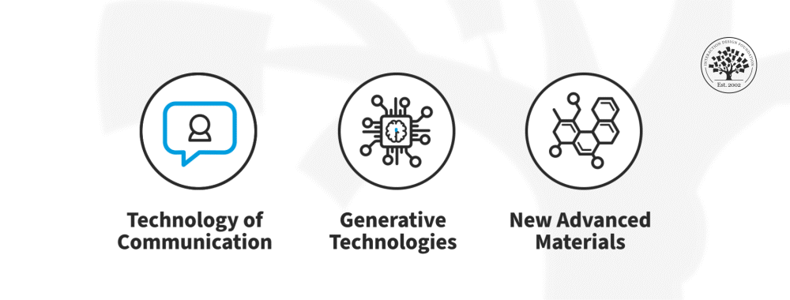

## Impact of Emerging Technologies

### Key Technologies

- Communication technologies:
  - Enable remote work and global collaboration.
  - Reduce reliance on physical workplaces.
- Generative technologies (AI):
  - Create images, text, videos, and other content.
  - Continuously improving and expanding capabilities.
- Advanced materials & 3D printing:
  - Enable stronger, lighter, and more sustainable designs.

### Effects on Design Work

- New ways of working:
  - Remote collaboration becomes effective and common.
- Increased efficiency:
  - Tools reduce manual and repetitive work.
- Expanded possibilities:
  - Designers can explore more complex and innovative solutions.

## Technology and Jobs

### Common Concern

- Job displacement:
  - Fear that automation will replace human roles.

### Historical Perspective

- Technology impact:
  - Often eliminates some jobs.
  - Creates more new opportunities overall.

### Key Insight

- Human role remains essential:
  - Tools require human direction and purpose.
  - Creativity and decision-making cannot be automated.

## Human–Technology Collaboration

### Role of Tools

- Automate tedious tasks:
  - Calculations, rendering, repetitive processes.
- Enhance accuracy:
  - Reduce human error in routine work.

### Role of Humans

- Ask the right questions:
  - Define problems clearly.
- Guide the process:
  - Frame inputs and evaluate outputs.
- Provide creativity:
  - Generate ideas and meaning.

### Design Principle

- Collaboration focus:
  - Design systems where humans and machines complement each other.

## Designing Better Tools

### Responsibilities of Designers

- Optimize human–machine interaction:
  - Ensure tools support human strengths.
- Reduce cognitive load:
  - Offload boring and repetitive tasks to machines.
- Enhance user experience:
  - Make tools intuitive and effective.

## Opportunities with New Materials and Technologies

### Innovations

- Biomaterials:
  - Reduce environmental impact.
- 3D printing:
  - Create optimized structures (lightweight + strong).
- Intelligent systems:
  - Automatically determine optimal design solutions.

### Benefits

- Sustainability:
  - Less waste and environmental harm.
- Performance:
  - Stronger and more efficient products.
- Creativity:
  - Unlock new forms and structures.

## Takeaways

- Design evolution:
  - Driven by rapid technological advancements.
- Job outlook:
  - More opportunities, not fewer, with new tools.
- Core skill:
  - Human creativity and problem framing remain critical.
- Future direction:
  - Design for collaboration between humans and intelligent systems.
- Opportunity:
  - Leverage new materials and technologies for sustainable innovation.
