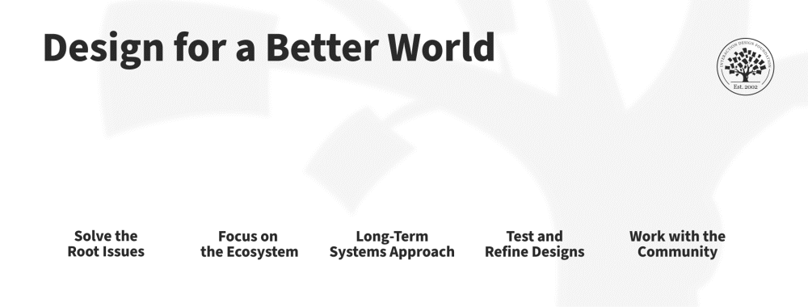

## Humanity-Centered Design Principles

### Overview

- Humanity-centered design: An extension of human-centered design that expands focus to all people, ecosystems, and long-term societal impact.
- Core idea: Design must address not only users, but also those affected by production, use, and disposal.

### The Five Principles

#### 1. Solve Root Causes

- Root issues: Address underlying causes, not just visible symptoms.
- Problem finding: Designers must identify the real problem behind what is presented.

#### 2. Focus on the Entire Ecosystem

- Ecosystem: Includes people, all living beings, and the physical environment.
- Impact scope:
  - Product creation
  - Product usage
  - Product disposal

#### 3. Take a Long-Term Systems View

- Systems thinking: Recognize that everything is interconnected.
- Long-term impact:
  - Effects may take years or decades to appear
  - Decisions must consider future consequences

#### 4. Iterate with Continuous Testing

- Iterative design: Prototype, test, and refine continuously.
- Validation:
  - Ensure designs truly meet real needs
  - Include both people and ecosystem considerations

#### 5. Design with the Community

- Co-design: Solutions must be created _with_ communities, not imposed on them.
- Designer role:
  - Facilitator
  - Mentor
  - Resource provider

## Role of Designers in Complex Systems

### Collaboration Across Disciplines

- Multidisciplinary work:
  - Engineers (civil, mechanical, software)
  - Social scientists
  - Political experts
  - Project managers
- Designer responsibility:
  - Bring experts together
  - Ensure alignment toward human experience

### Designer as System Orchestrator

- Conductor role: Coordinate different disciplines like an orchestra.
- Balance priorities:
  - Project management → cost, time, efficiency
  - Design → human experience and impact

### Community-Centered Approach

- Avoid top-down design:
  - Do not impose external solutions
  - Avoid “colonial” mindset
- Leverage local knowledge:
  - Communities understand their own problems
  - Designers support with tools and resources

## Key Takeaways

### Expanded Scope of Design

- From:
  - Individual users
- To:
  - Communities
  - Societies
  - Ecosystems

### Principles in Practice

1. Identify root causes
2. Consider full ecosystem impact
3. Think long-term
4. Iterate continuously
5. Co-create with communities

### Designer Mindset

- From problem solver → problem finder
- From creator → facilitator
- From product focus → system-level impact

### Ultimate Goal

- Create solutions that:
  - Improve human life
  - Respect ecosystems
  - Sustain long-term global well-being
