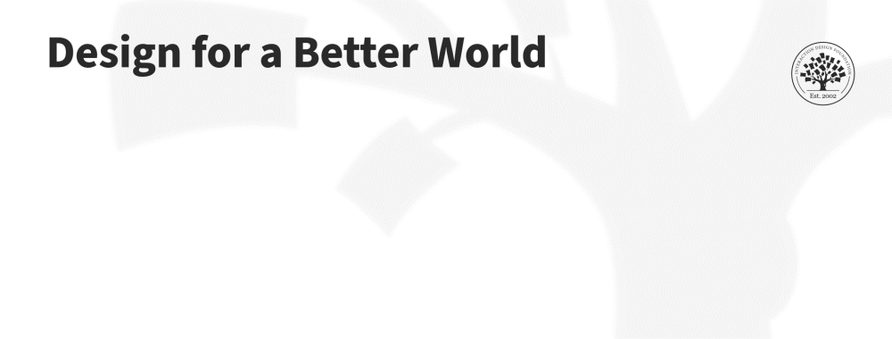

## Meaningful Design

### Making Complex Ideas Understandable

- Meaningful design: Design that makes systems, information, and products understandable for **ordinary people**, not only specialists.
- Accessibility of knowledge: Information should be clear to everyone, including non-experts.
- Designer responsibility: Designers must translate complex concepts into understandable experiences.

Designers should focus on making systems **interpretable, usable, and understandable by the public**, rather than only by experts in specific fields.

## Sustainable Design

### Circular Economy and Long-Term Thinking

- Sustainability: Designing solutions that do not harm ecosystems or future generations.
- Circular design: Designing products and systems so materials are **reused, recycled, or regenerated** instead of discarded.
- Circular economy: An economic system that minimizes waste and maximizes resource reuse.

Designers must rethink how products are created, used, and disposed of to support **long-term environmental sustainability**.

## Humanity-Centered Design

### Expanding Beyond Individual Users

- Humanity-centered design: Design that considers **all humanity and the planet**, not just individual users.
- System perspective: Design decisions should consider impacts on society, ecosystems, and future generations.
- Broader responsibility: Designers must move beyond narrow product thinking to address **large-scale societal challenges**.

Humanity-centered design requires a **broader and more complex approach** than traditional human-centered design.

## Human Behavior as the Core Challenge

### The Real Problem Is Not Technology

- Human behavior: The most critical factor affecting global problems.
- Technology limitation: Technological solutions alone cannot solve societal issues.
- Behavioral complexity: People have diverse beliefs, motivations, and habits that influence outcomes.

Designers must focus on **how people behave**, not only on building new technologies.

### Studying Real Human Behavior

Designers rely on research methods to understand people:

- Field studies: Observing people in their real environments.
- Anthropological research: Studying culture, habits, and social behavior.
- Contextual observation: Understanding how people actually use products and systems.

These methods help designers discover **real needs and real behaviors**, which often differ from assumptions.

## Participatory and Community-Led Design

### Designing With People, Not Just For Them

- Participatory design: A design approach where users collaborate in the design process.
- Community-led design: Solutions developed with the involvement of the communities affected by them.

This approach allows designers to:

- Understand local contexts
- Co-create solutions with stakeholders
- Develop designs that people are more likely to adopt

## Key Takeaways

- Designers must create **meaningful and understandable solutions**.
- Design should support **sustainability and circular systems**.
- The scope of design must expand to **all humanity and the planet**.
- The **real challenge is human behavior**, not technology.
- Designers must study people deeply and collaborate with communities to create impactful solutions.

## References

- Interaction Design Foundation, [Radical Participatory Design: Insights From NASA’s Service Design Lead](https://ixdf.org/master-classes/radical-participatory-design-insights-from-nas-as-service-design-lead)
- Interaction Design Foundation, [Agile Methods for UX Design](https://ixdf.org/courses/agile-methods-for-ux-design)
- Interaction Design Foundation, [Participatory Design](https://ixdf.org/literature/topics/participatory-design)
