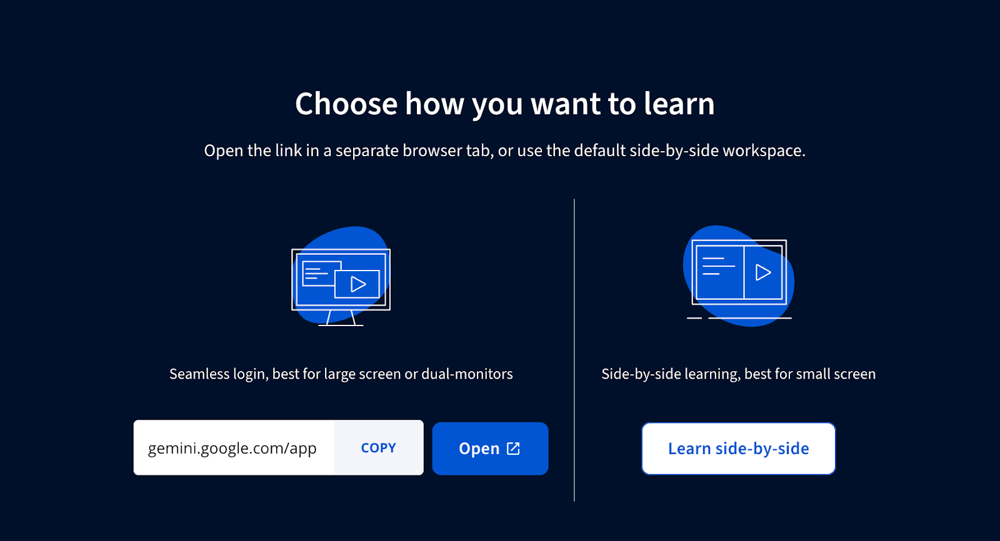
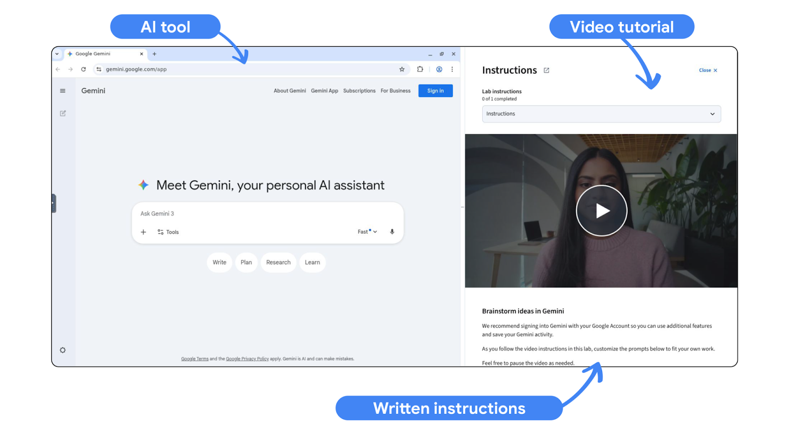
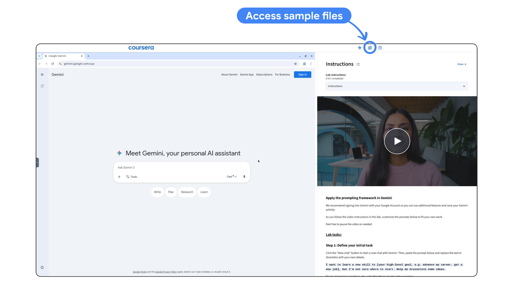
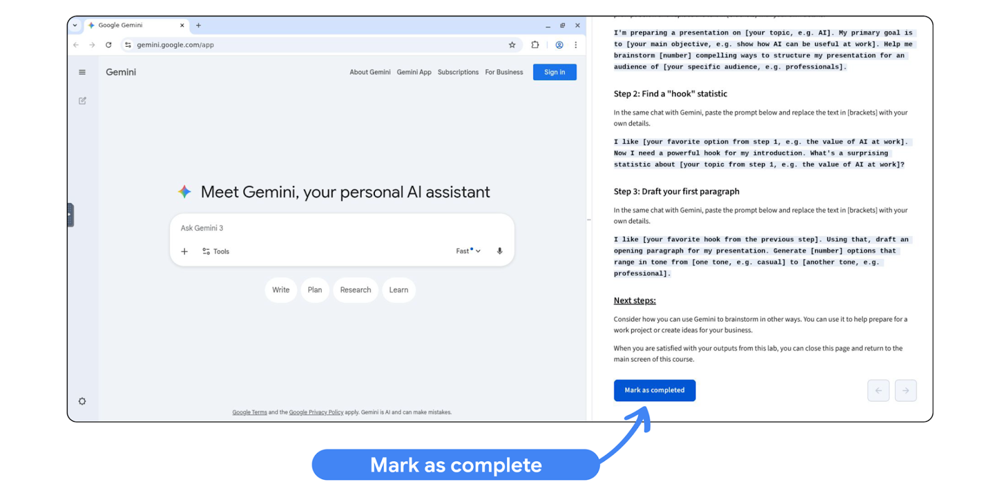

## How to Get the Most Out of AI Labs

### Purpose of the Labs

- Hands-on AI learning: Practical exercises designed to simulate real workplace tasks.
- Lab structure:
  - Expert-led video tutorials
  - Step-by-step written instructions
- Learning outcome:
  - Build a portfolio of AI projects that can be applied directly at work.

### How to Launch a Lab

Labs should be completed on a computer rather than the mobile app.

Process:

1. Click **Launch lab**.
2. A new browser tab opens.
3. Choose one of two learning modes.



### Lab Learning Modes

#### Seamless Login

- Seamless login: Opens a new tab with the AI tool already loaded.

Workflow:

- Use the AI tool in one tab.
- Follow the video tutorial and written instructions in another tab.

Requirement:

- Log into your Google account to save work.

#### Side-by-Side Learning (Recommended)

- Side-by-side learning: A split-screen workspace for practicing and following instructions simultaneously.



Interface layout:

- Left side:
  - Virtual browser with AI tool (e.g., Gemini).
  - Area for running prompts and saving work.
- Right side:
  - Video tutorial
  - Written lab instructions.

### Working with Sample Prompts

Sample prompts are included in the written instructions.

Process:

1. Copy the prompt: Select and copy the highlighted text.
2. Paste the prompt: Paste it into the AI tool prompt box.
3. Edit the prompt: Replace bracketed text with your own details.

Note:

- Keyboard shortcuts for copy and paste may not work in labs.

### Using Files in Labs

Some labs require uploading or analyzing files.



Options include:

- Using provided sample files
- Uploading personal files

#### Using Sample Files

Process:

1. Click the file icon in the lab instructions.
2. Select **Use Template**.
3. The file will be saved to your Google Drive.
4. Upload or use the file within the AI tool.

#### Uploading Your Own Files

Process:

1. Click the **+** icon in the prompt box.
2. Select **Add from Drive**.
3. Choose the file you want to upload.

### Completing a Lab



Steps to finish a lab:

1. Complete all instructions in the lab.
2. Scroll to the end of the written instructions.
3. Click **Mark as completed**.
4. Close the browser tab.
5. Return to the course page.
6. Select **Go to next item**.

### Applying Labs to Real Work

To maximize the value of labs:

- Apply learned techniques to your own tasks.
- Experiment with AI tools on real workplace problems.
- Build practical experience through repeated use.

## Brainstorming Presentation Ideas with Gemini

### Purpose of the Lab

- Goal: Practice using AI to brainstorm and develop ideas for a presentation.
- Tool used: Gemini.
- Recommendation:
  - Sign in with a Google account to save activity and access additional features.
  - Customize prompts to match your own work tasks.

### Step 1: Brainstorm Presentation Structures

Ask Gemini to generate different ways to organize a presentation.

Process:

1. Start a new chat in Gemini.
2. Paste and customize the prompt.
3. Request multiple presentation structure ideas.

Example prompt structure:

- Topic: The subject of the presentation.
- Objective: The main goal of the presentation.
- Audience: The intended listeners.

Example task:

```
I'm preparing a presentation on [your topic, e.g. AI]. My primary goal is to [your main objective, e.g. show how AI can be useful at work]. Help me brainstorm [number] compelling ways to structure my presentation for an audience of [your specific audience, e.g. professionals].
```

### Step 2: Find a Hook Statistic

Use Gemini to identify a compelling statistic for the presentation introduction.

Process:

1. Continue in the same chat.
2. Select your preferred presentation structure from Step 1.
3. Ask Gemini for a surprising statistic related to the topic.

Purpose:

- Capture the audience’s attention at the beginning of the presentation.

Example task:

```
I like [your favorite option from step 1, e.g. the value of AI at work]. Now I need a powerful hook for my introduction. What's a surprising statistic about [your topic from step 1, e.g. the value of AI at work]?
```

### Step 3: Draft the Opening Paragraph

Ask Gemini to create introduction paragraphs using the selected hook.

Process:

1. Use the chosen hook statistic.
2. Request several opening paragraph options.
3. Specify different tones for the writing.

Example tone variations:

- Casual
- Professional

Goal:

- Produce multiple introduction styles to choose from.

Example task:

```
I like [your favorite hook from the previous step]. Using that, draft an opening paragraph for my presentation. Generate [number] options that range in tone from [one tone, e.g. casual] to [another tone, e.g. professional].
```

### Extending the Brainstorming Process

Gemini can also support other idea-generation tasks.

Examples include:

- Preparing ideas for work projects
- Generating business concepts
- Exploring creative directions for presentations or reports

Key practice:

- Experiment with prompts and refine them to produce better results.
